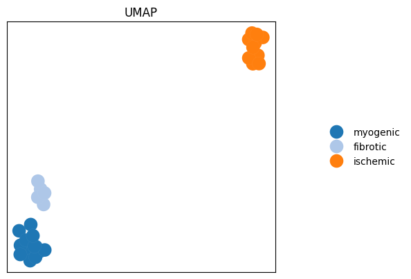
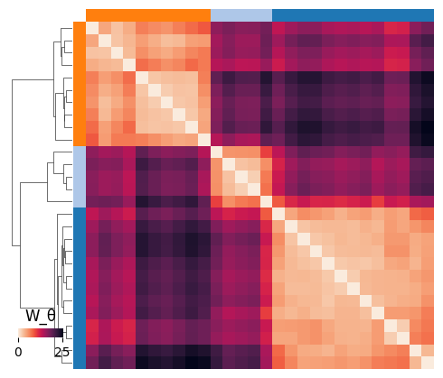

# Getting started with single cell RNA data

In this tutorial, we show how to load and use scRNA datsets. GGML-OT supports using [anndata](https://anndata.readthedocs.io/en/stable/) objects stored in `.h5ad` files as input.
We show two methods on how to load and use a scRNA dataset. For the first one, we work on the whole dataset.

```python
import ggml_ot

import requests
import anndata as ad
import os
import numpy as np
from torch.utils.data import DataLoader
import matplotlib.pyplot as plt
```

If the desired dataset is not already saved locally, downlaod it. For the examples, the myocardial infarction provided by [Kuppe](https://www.nature.com/articles/s41586-022-05060-x) et al. is used.:
```python
url = "https://datasets.cellxgene.cziscience.com/c1f6034b-7973-45e1-85e7-16933d0550bc.h5ad"
local_path = "data/czi_dataset.h5ad"

# create the directory if it does not exist
os.makedirs(os.path.dirname(local_path), exist_ok=True)

# download and save the file
with requests.get(url, stream=True) as r:
    r.raise_for_status()
    with open(local_path, "wb") as f:
        for chunk in r.iter_content(chunk_size=8192):
            f.write(chunk)
```

If you do not want to work on the whole dataset because of limited resources, you can partly load the data into memory and subsample it beforehand. For this, the dataset is loaded in "backed" mode which only loads what is currently needed into memory and is saved in a new file:
```python
adata = ad.read_h5ad(local_path, backed="r")

# subsample dataset to 10,000 cells
n_cells = adata.n_obs
sample_size = 10000  # adjust as needed
if sample_size > n_cells:
    raise ValueError("Sample size is larger than total number of cells!")
idx = np.random.choice(n_cells, size=sample_size, replace=False)

# load only the subset into memory
adata_subset = adata[idx, :].to_memory()

# save the subsampled dataset for later use
adata_subset.write("data/subset_10000.h5ad")
local_path = "data/subset_10000.h5ad"
```

Note that when using the subsampled dataset, some parameters may be adjusted to match the new dataset's size which will be shown later in the tutorial.

Generate the training data from the loaded data:
```python
training_data = ggml_ot.scRNA_Dataset(local_path)
```
See the documentation of [scRNA_Dataset](ggml_ot.scRNA_Dataset) to adapt the parameters as needed to the used dataset.

Or like this
```python
training_data = ggml_ot.scRNA_Dataset(local_path, n_cells=50)
```

when using the subsampled version. `n_cells` denotes the number of cells to subsample per patient and defaults to 1000 if not specified.

To train the model for the global ground metric on the scRNA dataset, call the generated dataset in a Dataloader

```python
train_dataset = DataLoader(training_data, batch_size=128, shuffle=True)
```

and train the model using the function [ggml](ggml_ot.ggml):

```python
w_theta = ggml_ot.ggml(train_dataset, l=1, max_iterations=5, plot_i_iterations=5, dataset=training_data)
```

This will train the model on the dataset for 5 iterations. Again, see the documentation of [ggml](ggml_ot.ggml) to adapt the training process adjusting the parameters as needed.

After training, the function outputs a [patient-level embedding](ggml_ot.plot_emb) and a [clustermap](ggml_ot.plot_clustermap) of the resulting distance matrix:




