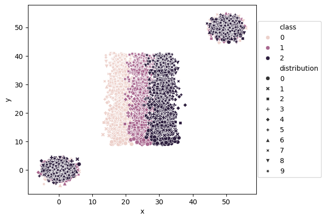
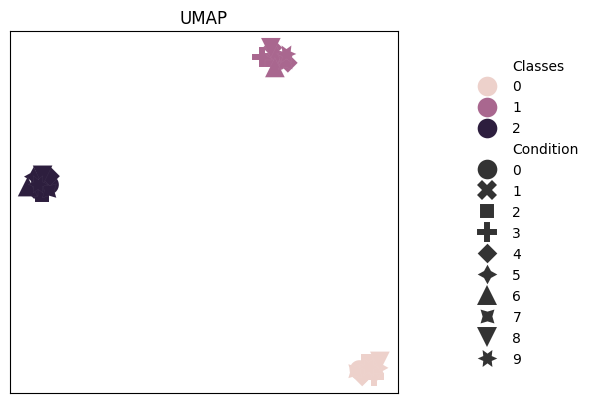
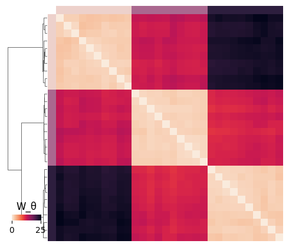

# Getting started with synthetic datasets

In this tutorial, we show how to generate a basic synthetic dataset and further work with it.

```python
import ggml_ot

import numpy as np
import seaborn as sns
from torch.utils.data import DataLoader
import matplotlib.pyplot as plt
```

Generate a synthetic dataset:
```python
data = ggml_ot.synthetic_Dataset()
```

This will create a dataset with three distributions, each with 100 points, where the values of each distribution are shifted vertically to create distinct groups, and plot the element-level embedding:



For further information on how to adapt the parameters to create different synthetic datasets, check out the [get_pointcloud](ggml_ot.synthetic_Dataset) function.

Now, to train the model for the global ground metric on the given dataset, call the generated dataset in a Dataloader

```python
training_dataset = DataLoader(data, batch_size=128, shuffle=True)
```

and train the model with the function [ggml](ggml_ot.ggml):

```python
w_theta = ggml_ot.ggml(training_dataset, norm=1, max_iterations=20, plot_i_iterations=20, dataset=data)
```

This will train the model on the dataset for 20 iterations. Again, adapt the training process adjusting the parameters like the margin `a` or the regularization strength `l` as needed.

After training, the function outputs a [distribution-level embedding](ggml_ot.plot_emb) and a [clustermap](ggml_ot.plot_clustermap) of the resulting distance matrix:




