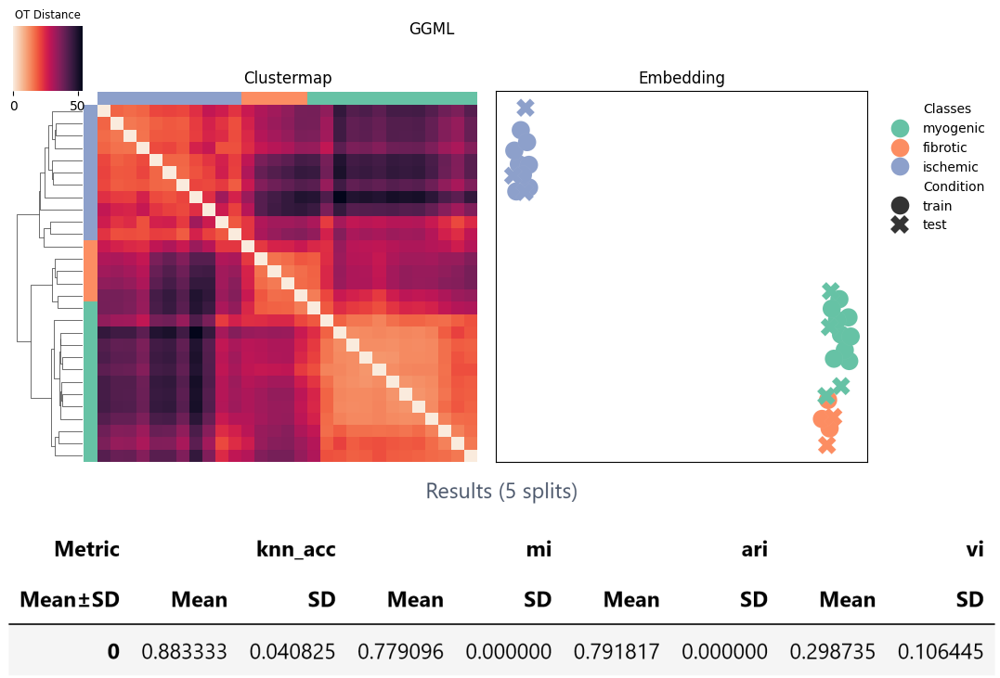

# {octicon}`play;1em;` Quickstart guide
In the following tutorials, we provide guidance on all relevant functions of the ggml-ot package.

## Supervised OT on AnnData
```{nbgallery}
ggml_anndata_tutorial
ggml_biological_analysis
ggml_fast_approximations
```
## Tuning & validation

```{nbgallery}
ggml_hyperparameter_tuning
ggml_cross_validation
```

## Understand the methodology

```{nbgallery}
ggml_method_introduction
```


