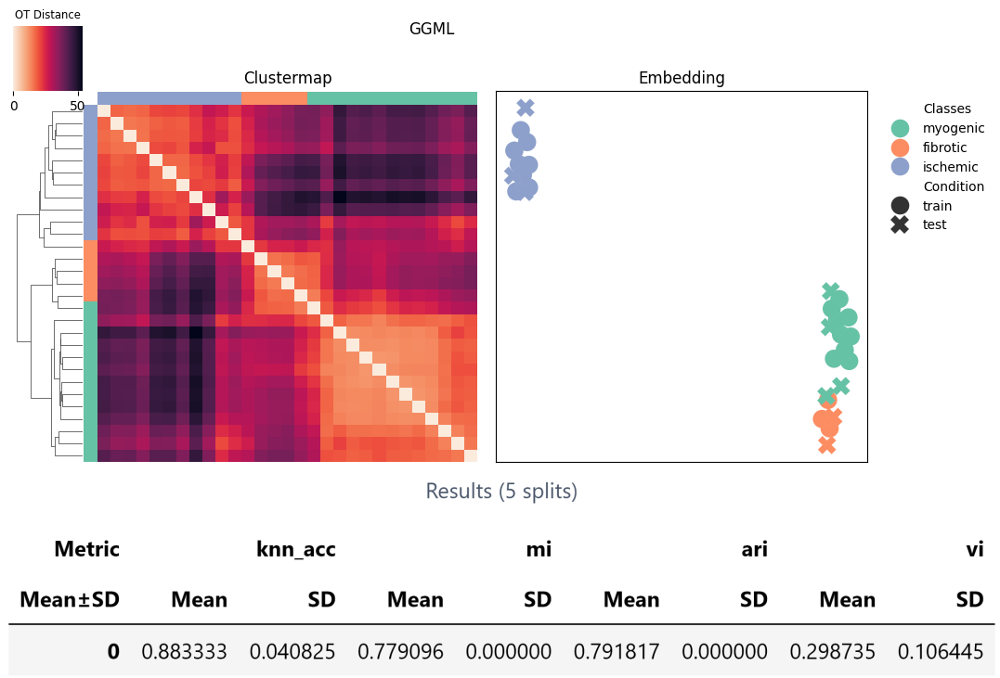

# {octicon}`play;1em;` Tutorials
In the following tutorials, we provide guidance on all relevant functions of the ggml-ot package.

## Supervised Optimal Transport
```{nbgallery}
1_basic_tutorial
2_biological_analysis
```

## Tuning & Performance
```{nbgallery}
3_hyperparameter_tuning
4_gpu_sinkhorn
5_fast_approximations
```
```{raw} html
<div class="nbsphinx-gallery">
<a class="reference internal" href="1_basic_tutorial.html#Cross-validation-with-train_test()" title="Cross-validation with train_test() in the basic tutorial">
  <div></div>
  <div>Cross-validation</div>
</a>
</div>
```

## Method & Theory
```{nbgallery}
0_ggml_method_introduction
```



