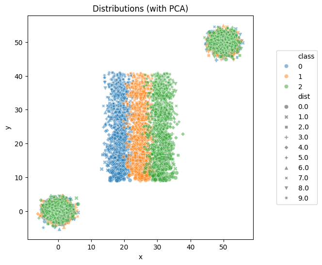
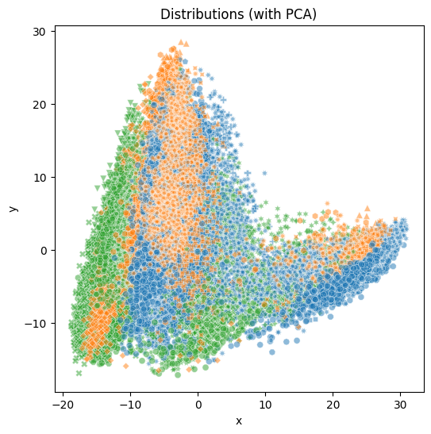
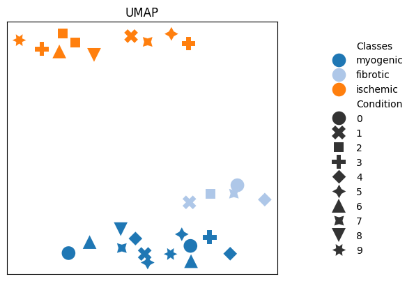

# Visualization

GGML-OT provides several visualization methods to inspect the data and learned distance matrices.

## Plotting the distributions

[plot_emb](ggml_ot.plot_emb) allows us to visualize high-dimensional distributions in 2D using optional PCS projection. The distributions are plotted as a scatter plot where the classes are distinguishable by color and the distributions by shape.

Continuing the example from the [Synthetic Dataset Tutorial](synth.md), the plotted distributions may look like this:

```python
train_features, train_labels = next(iter(training_dataset))
trpl_distributions = train_features[0]
trpl_label = train_labels[0]
ggml_ot.plot_distribution(trpl_distributions[:, :, :2], np.asarray(trpl_label, dtype=int))

plt.show()
```



Or like this using PCA for the scRNA dataset:
```python
a = data.distributions
b = data.distributions_labels
ggml_ot.plot_distribution(a, b, title="Distributions (with PCA)", legend=True)
plt.show()
```


## Potting the ellipses of covariance matrices

[plot_ellipses](ggml_ot.plot_ellipses) visualizes 2D covariance matrices as ellipses, shown below by using the synthetic dataset.

```python
np.set_printoptions(suppress=True, precision=16)

fig, axs = plt.subplots(ncols=3, figsize=(12, 6))

# plot no.1: Euclidean distance (identity matrix as covariance)
ax = ggml_ot.plot_ellipses(np.identity(2), ax=axs[0])
ax.set_title(r"Euclidean $d_2$ (Baseline)")

# plot no.2: Mahalanobis distance (based on w_theta)
m = np.transpose(w_theta) @ w_theta  # Mahalanobis matrix
ax = ggml_ot.plot_ellipses(m[:2, :2], ax=axs[1])
ax.set_title(r"Mahalanobis $d_\theta$ (GGML)")

# plot no.3: Euclidean and Mahalanobis distances
ax = ggml_ot.plot_ellipses([np.identity(2), m[:2, :2]], ax=axs[2])
ax.set_title(r"Euclidean and Mahalanobis")

plt.tight_layout()
plt.show()
```


## Plotting data as a heatmap

This function visualizes a 2D matrix as a heatmap, where each cell’s color represents the magnitude of the corresponding matrix entry. [plot_heatmap](ggml_ot.plot_heatmap) provides an intuitive way to observe similarities and patterns within the data.
Again, this is shown by the distance matrix using the learned ground metric on the synthetic dataset which is computed using the function compute_OT_on_dists:

```python
D_ggml = data.compute_OT_on_dists(w=w_theta, plot=False)
ggml_ot.plot_heatmap(D_ggml)
```

## Plotting embeddings of distance matrices
[plot_emb](ggml_ot.plot_emb) visualizes the embedding of a distance matrix using various reduction methods in form of a scatter plot. Using this function on the scRNA dataset from the example from the [scRNA Dataset Tutorial](scRNA.md), the embedding can be visualized as follows:

```python
symbols = [i % 10 for i in range(len(training_data.distributions))]
colors = training_data.distributions_labels

emb = ggml_ot.plot_emb(
    D_ggml,
    method="umap",
    colors=training_data.disease_labels,
    symbols=symbols,
    legend="Side",
    title="UMAP",
    verbose=True,
    s=200,
)
```



## Plotting the data as a clustermap

This function visualizes distance matrices as a hierachically-clustered heatmap which helps reveal groupings by reordering the matrix to highlight clusters of similar values. [plot_clustermap](ggml_ot.plot_clustermap) is used in [ggml](ggml_ot.ggml) to visualize the learned distance matrix.
